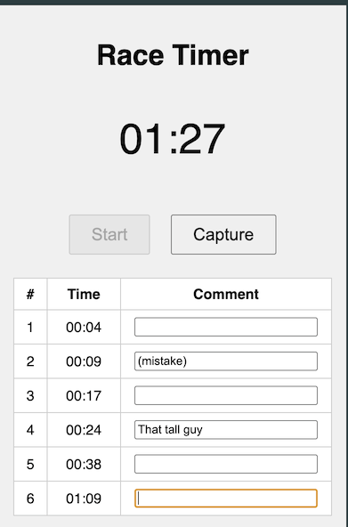
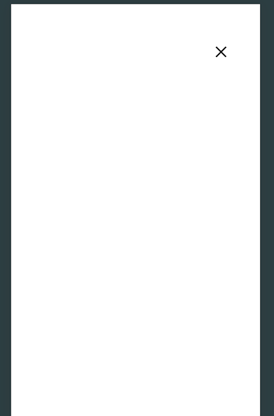
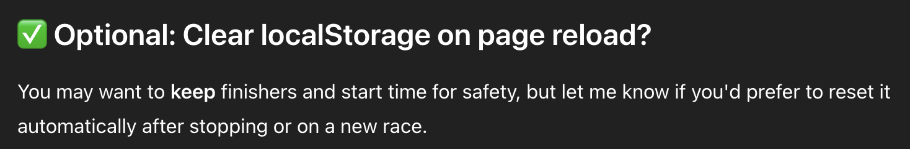
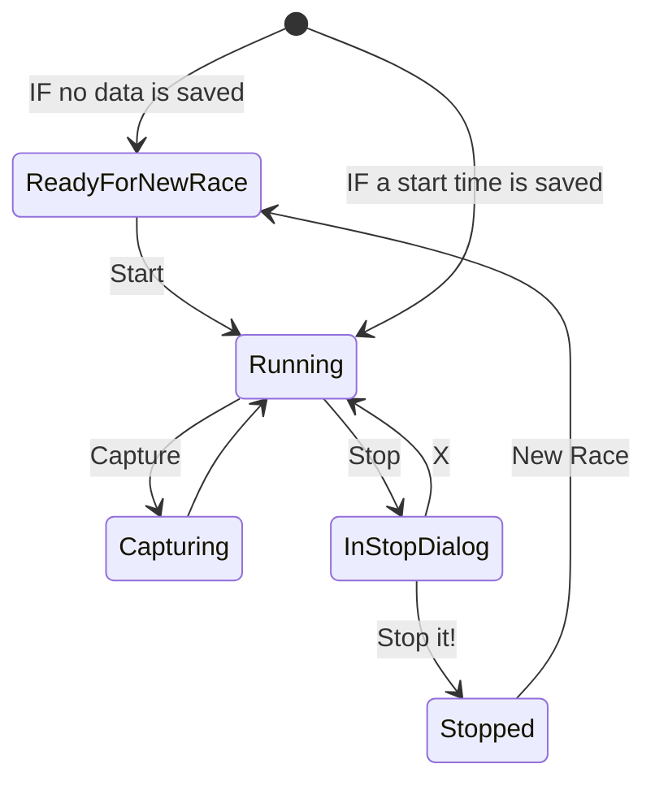
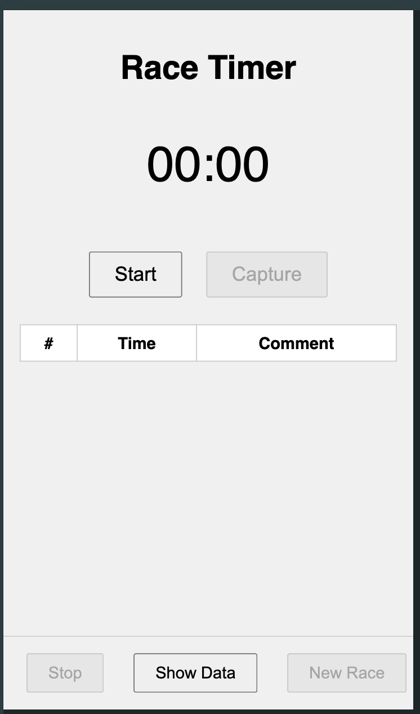
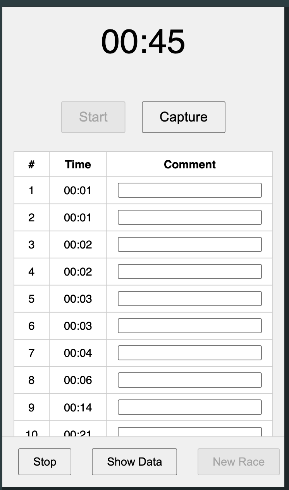
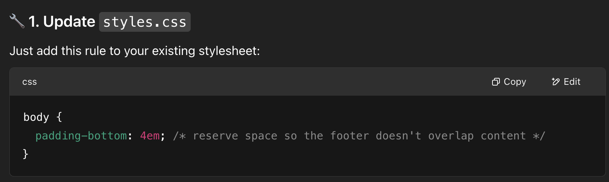
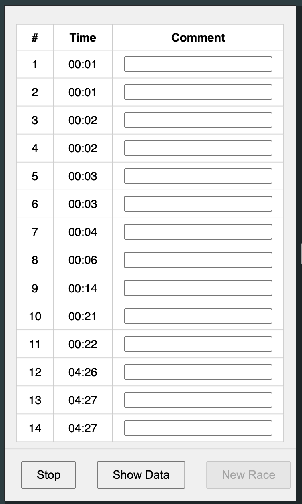

# Finishers
Capture the finishing times of a sports competition. Scaffolded by ChatGPT.

## Features
* Start button to begin the timer (disables itself afterward)
* Live timer display in mm:ss format
* Capture button to record the time of finishers
* Table showing captured times with comments
* LocalStorage support to persist captured finishers

</img>

## Prompts And Manual Changes

The code started out by prompting the free version of ChatGPT.

### Prompt #1: First Prompt - The Initial Requirements

```
Scaffold a simple HTML/CSS/Javascript based mobile app to capture finishers of a sports competition.

* Button "Start" to start the timing - shall be disabled after it has been pressed
* Large timer showing the time that has already passed. Format: mm:ss
* Button "Capture" to capture the time of the next finisher
* A table with a row for each already captured time:
   * a consecutive number
   * the captured time
   * a text field to enter occasional comments
* There is no active backend
* All data has to be immediately stored to local storage of the browser

No frameworks or libraries
```

### Prompt #2: Refinement - Splitting Into Multiple Files
```
Please split HTML/CSS/JavaScript into separate files. Thank you.
```

#### Result
The result is pretty nice and simple and seems to be fully functional. It can be seen in the [initial commit](https://github.com/paulroho/finishers/commit/47c9ff41e42e553587a634bdadee31decd3ad387).


### Prompt #3: Adding Features: Stopping and Data Display

```
Nice!

Now we need to add these additional features, please:
* Button "Stop":
  * Adds overlay:
    * full-screen
    * translucent
    * Textbox "Type 'STOP'"
    * Button "Stop it!"
      * Enabled just if "STOP" has been typed into the textbox
      * Located at the bottom of the page
      * Background color red
      * Stops the timer
      * Disables button "Capture"
      * Hides the overlay
    * Icon on the top right to go back to the main screen
  * Button "Show data"
    * Displays stored data
      * in a simple CSV format
      * using a monospace font
      * full screen
    * Icon on the top right to go back to the main screen

Ideally, separate artifacts for the overlays into separate files.
```

#### Result
The [resulting code](https://github.com/paulroho/finishers/commit/ec944867e5ebe3d3ad66542c13c51799a0506588) is broken as the overlay screens are visible from the very beginning covering the start screen:
</img>

### Prompt #4: Asking To Fix The Issue
```
Please make sure that the two overlays are invisible at startup, because otherwise the main page cannot be seen.
```
#### Result
ChatGPT just highlighted the important parts in markup and CSS. But as this code was already there exactly like pointed out, this was of no help.

#### Analysis
The real problem was that the ChatGPT did not catch that the overlays had the rule `display:flex` in place which is more specific than the initial `display: hidden` via `class="hidden"` useless.

#### Fix
As a quick fix, I [manually added](https://github.com/paulroho/finishers/commit/377bf11160f35e9c587a27090d01e2bd5120adb7) `!important` to the CSS rule for the class `hidden`. That made the application usable again.

The result is now usable, but the next flaws get apparent.

### Prompt #5: Issue Lost Run Mode After Reload
The most dangerous issue was that a restart of the page while the timer is running would stop the timer making it impossible to get correct times.

So I tried this prompt:
```
Important change to resume to running mode if the site gets refreshed:
* Write the start time to local storage
* On load, if a start time exists in local storage, automatically go to run mode starting from the saved time
```

#### Result
ChatGPT answered with [simple changes](https://github.com/paulroho/finishers/commit/02e480f797adadf260dce132ea136a81ca1ac4a2) to the event handlers of the start and the stop button and a function to reload the saved start time on page load.

At the end of the answer, ChatGPT also anticipated my next planned feature request as optional feature:


### Prompt #6: Adding Feature: New Race
Following up on the suggestion, I prompted:

```
Yes! Please, add a button "New Race" that
* is enabled only if the timer is not running
* clears all stored data
```

#### Result

[The result](https://github.com/paulroho/finishers/commit/c98f17f6c3f8fe5b43eaeb730b3ef1a9acb8825a) works basically fine. The check if a new race can be started (just if the timer is not running) is done in the event handler of the "New Race" button. This is nice and safe, but displaying the button as disabled is not consistently working.

### Manual Fix: Inconsistent Timer Reset
While playing around I noticed that the field `timerInterval` was not reset to `null` after `clearInterval(timerInterval)` was called. Therefore, even after the timer was stopped, a new race could not be started.

This small [manual change](https://github.com/paulroho/finishers/commit/e3948b247af0e788ffdd01529e1eb207610fe243) fixed it.

### Manual Fix: Button States
As the enabled/disabled state of the buttons is not perfect in all cases, I wrote this little state diagram to get that straight:



To get this work, I did some [manual changes](https://github.com/paulroho/finishers/commit/cb9c8f1815ecd0cd478eb179ceb12297fbc3ca9e), because I thought it would be too cumbersome to explain to ChatGPT what I want.


### Manual Fix: No Start After Reload If Data Exists
I noticed that after a reload of the page, the Start button was available even if data was already captured. [The fix](https://github.com/paulroho/finishers/commit/c96502748c9ea672f11db73a73b1b748dc438110) was easy.


### Prompt #7: Put Minor Buttons To A Footer
I now wanted to just have the two major buttons "Start" and "Capture" at the upper parts of the page, and move the minor buttons "Stop", "Show Data", and "New Race" to the footer.

This was the prompt:
```
Move the buttons "Stop", "Show Data", and "New Race" to the very bottom of the page. In case the table gets very long, they could be pushed below the fold.
```

#### Result
Design-wise [the solution](https://github.com/paulroho/finishers/commit/f847623bab2fcf7e3569270d6b90653944fbca27) was pretty nice:


Interestingly, the last scentence of my prompt got disregarded, because for many captured times, the buttons at the bottom do not get pushed, but remain sticky at the bottom. This has the problem that the last item of the table is hidden behind the footer:

In this example I had 11 items in total, but the page could not be stably scrolled to uncover that last row.


### Prompt #8: Uncovering The Whole Table
I first thought, that could be tough, maybe wrapping the whole page in a flex grid, but with that prompt ChatGPT showed that a one-liner was sufficient:

```
Make sure the sticky footer does not cover lower rows of the table.
```

The suggestion was that simple:


I must admit, I did not expect with the `position: fixed` of the footer, a `margin` of the `<body>` tag would not matter. But it worked (after taking a little bigger padding at the bottom of the body than what ChatGPT suggested):

